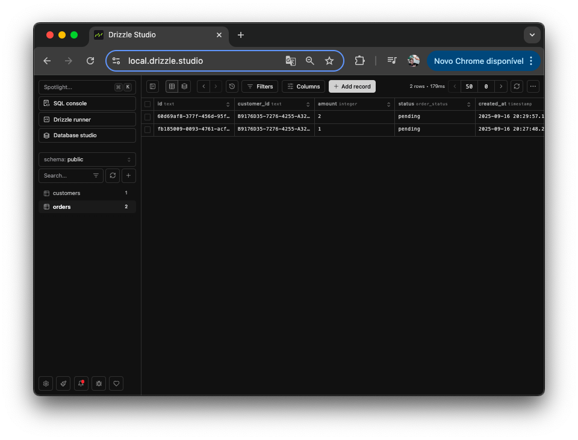
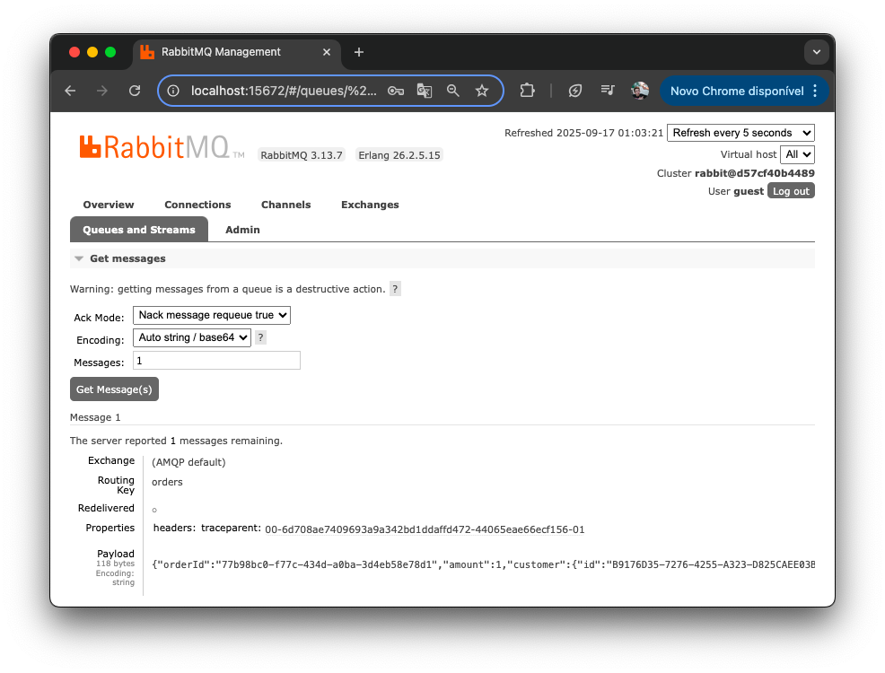
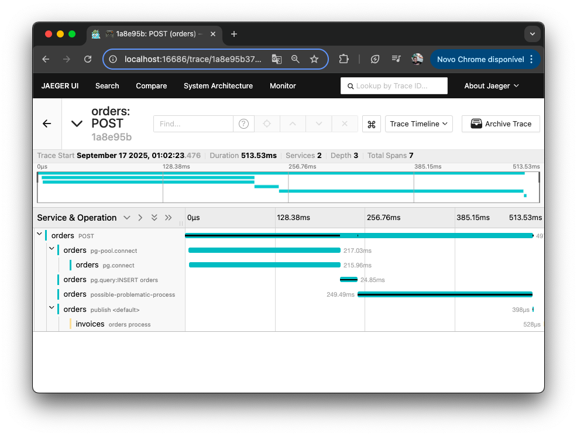
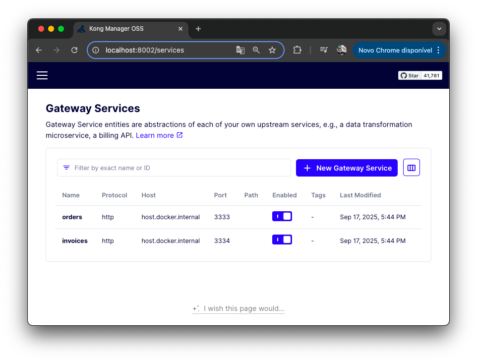

# desafio-microsservicos

## 🚀 Projeto
Integração entre diferentes microsserviços de um e-commerce, com mensageria e observabilidade. Projeto do curso de Microsserviços da [@Rocketseat](https://app.rocketseat.com.br/), feito em set/25.

<div align="center">
  
  
  
  
</div>

## 🛠️ Tecnologias
- [Node.js](https://nodejs.org/en)
- [Docker](https://www.docker.com)
- [Postgres](https://www.postgresql.org)
- [RabbitMQ](https://www.rabbitmq.com) (Message Broker)
- [Jaeger](https://www.jaegertracing.io) (Tracing)
- [Kong](https://konghq.com/products/kong-gateway) (API Gateway)

## 🗂️ Utilização

### 🐑🐑 Clonando o repositório:

```bash
  $ git clone url-do-projeto.git
```

### ▶️ Rodando o App:

```bash
  $ cd desafio-microsservicos     # change to that directory
  $ cd path-to-a-microsservice    # change to that directory
  $ cd app-orders                 # ex

```

- Terminal 1: Server
```bash
  # V1: run @ localhost
  $ npm install     # download dependencies
  $ npm run dev     # start the project by running the package.json script

  # V2: run @ Docker
  $ docker build -t name-of-docker-image .    # build the image
  $ docker build -t service-orders .          # ex
  $ docker run [flags] name-of-docker-image   # run the container
  $ docker run -p 3333:3333 service-orders    # ex
  $ ctrl + C                                  # stop the container
```

- Terminal 2: Database
```bash
  $ docker compose up         # build the image and runs the container
  $ ctrl + C                  # stop the container
  $ docker compose down       # delete the container
```

- Terminal 3: SQL
```bash
  $ npx drizzle-kit generate  # create the .sql files based on the db schema
  $ npx drizzle-kit migrate   # execute the SQL commands from the db/migrations files
  $ npx drizzle-kit studio    # db UI (OBS: Safari browsers block access to localhost by default)
```

- Terminal 4: Serviços top-level
```bash
  # path: root ("docker-compose.yaml" file @ root of dir)
  $ docker compose up         # build the image and runs the container

  # RabbitMQ UI: http://localhost:5672 (user: "guest"; password: "guest")
  # Jaeger UI: http://localhost:16686 
  # Kong UI: http://localhost:8002
```
